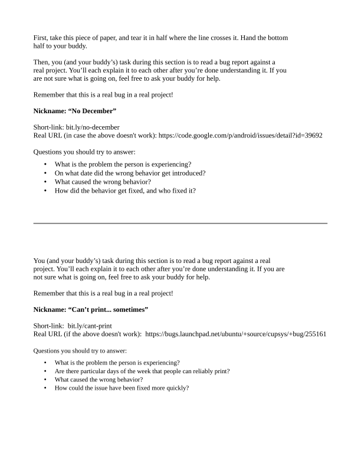
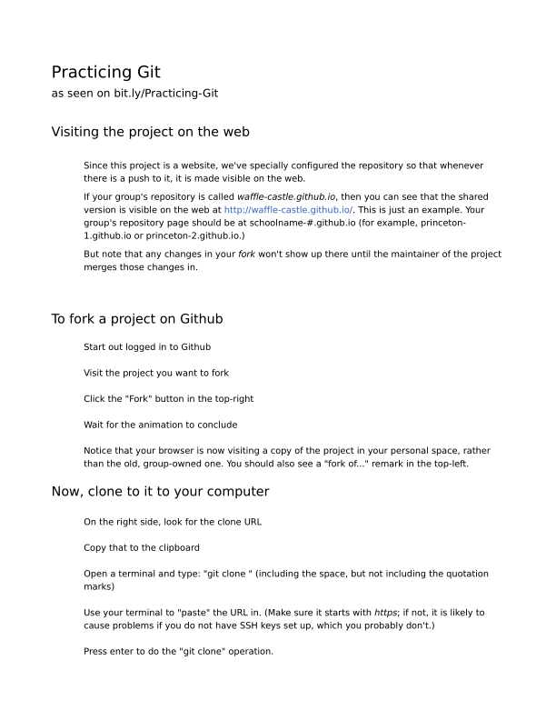
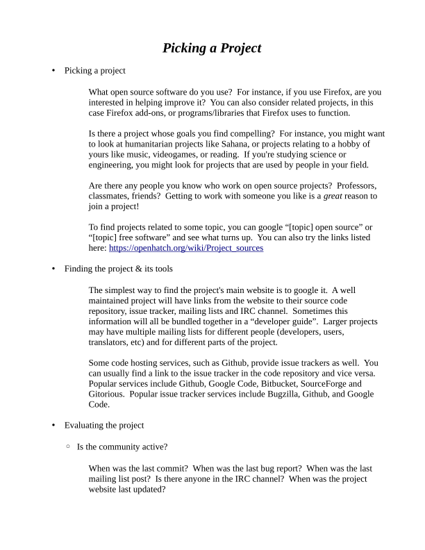
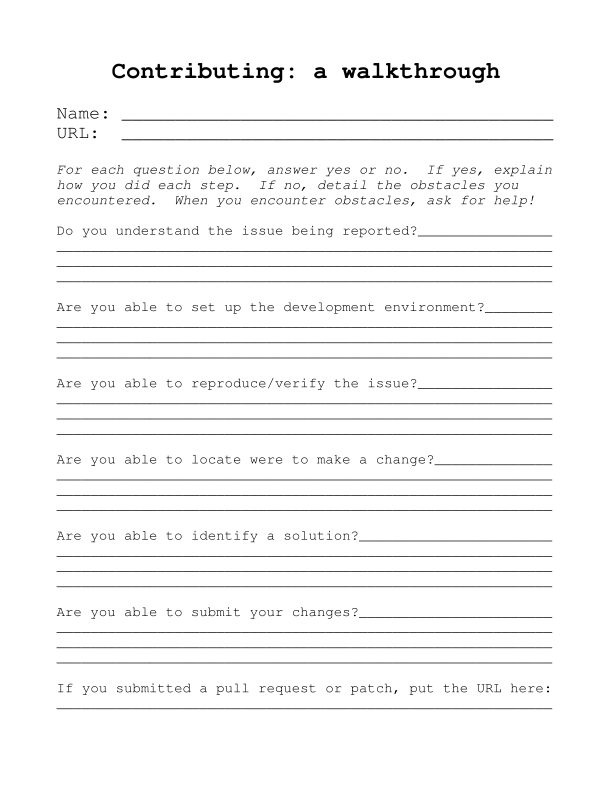

## Schedule

### Sign in

### 10:00 am to 10:30 / Laptop Setup and Introductions

> Meet your mentors and fellow students and get your laptop ready for the day.

All attendees go to <http://bit.ly/laptop-setup> and start setting up while
mentors go around to see if anyone got stuck.

### 10:30 am to 11:30 / Introduction to Free Software Tools

> Aims to answer the question “What is Open Source?” Aims to familiarize students
> with tools like IRC, issue trackers, mailing lists, and version control through
> several activities.

### 11:30 pm to 12:00 pm / Hands On Git

> Git is a powerful version control language that allows distributed teams of
> developers to collaborate on large software projects. A brief workshop will
> introduce students to the use of this tool.

### 12:00 pm to 1:00 pm / Lunch Break

> Lunch will be provided. Vegetarian, vegan, and other dietary options will be
> provided. Please contact us if you have any specific needs.

### 1:00 pm to 4:00 pm / Contribution Workshop

> Students will be looking through existing projects, working on issues and
> contributing solutions. Project leads and mentors will be available to provide
> assistance throughout the workshop.

